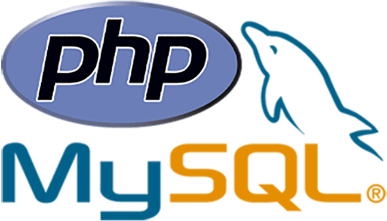

<div id="top"></div>

[![MIT License][license-shield]][license-url]

<!-- PROJECT LOGO -->
<br />
<div align="center">
  <a href="https://github.com/hypetf/react-search">
    
  </a>

  <h3 align="center">PHP Authentication System</h3>

  <p align="center">
    A simple authentication system created with PHP and mysqli
    <br />
    <a href="http://hypetf.lovestoblog.com/?i=1"><strong>View demo »</strong></a>
    <br />
</div>


<!-- ABOUT THE PROJECT -->
## About The Project

[![Product Name Screen Shot][product-screenshot]](https://github.com/hypetf/testt/blob/main/preview.png)

I have created this simple PHP authentication system as my first PHP project ever.<br/>
This was made to learn and develop my knowledge in this new field which would have been helpful to face the WorldSkills UK 2021 National Finals as it was required from a specific module.

<p align="right">(<a href="#top">back to top</a>)</p>


<!-- GETTING STARTED -->
## Getting Started

### Prerequisites
To run this project locally, you will need to have XAMPP and PHP installed.
This project was developed on PHP 8.0.

* [Download XAMPP](https://www.apachefriends.org/index.html)
* [Download PHP8](https://www.php.net/downloads)

### Setup

1. Clone the repository inside your project folder. This folder must be inside the `/xampp/htdocs` folder.
   ```sh
   git clone https://github.com/hypetf/php-auth-system.git
   ```
2. Open XAMPP and initialize the modules Apache and MySQL.
3. Open the Apache server by clicking on "Admin" on XAMPP and navigate to:
   ```sh
   http://localhost/phpmyadmin/
   ```
4. Create a database and a table with 4 columns:
   ```sh
   userid int(11) AUTO_INCREMENT
   userName varchar(128)
   userEmail varchar(128)
   userPwd varchar(128)
   ```
5. Update the variable `$dbName` in your `/dbh.inc.php` file with your database name that you have just created:
   ```sh
   /includes/dbh.inc.php
   ```
6. Navigate to the following link to see the project:
   ```sh
   http://localhost/your_projectFolder_name/home.php
   ```

<!-- CONTRIBUTING -->
## Contributing

Contributions are what make the open source community such an amazing place to learn, inspire, and create. Any contributions you make are **greatly appreciated**.

If you have a suggestion that would make this better, please fork the repo and create a pull request. You can also simply open an issue with the tag "enhancement".
Don't forget to give the project a star! Thanks again!

1. Fork the Project
2. Create your Feature Branch (`git checkout -b feature/AmazingFeature`)
3. Commit your Changes (`git commit -m 'Add some AmazingFeature'`)
4. Push to the Branch (`git push origin feature/AmazingFeature`)
5. Open a Pull Request


<!-- LICENSE -->
## License

Distributed under the MIT License. See `LICENSE.txt` for more information.

<p align="right">(<a href="#top">back to top</a>)</p>


<!-- MARKDOWN LINKS & IMAGES -->
[license-shield]: https://img.shields.io/github/license/othneildrew/Best-README-Template.svg?style=for-the-badge
[license-url]: https://github.com/hypetf/react-search/blob/master/LICENSE.txt
[product-screenshot]: ./preview.png
